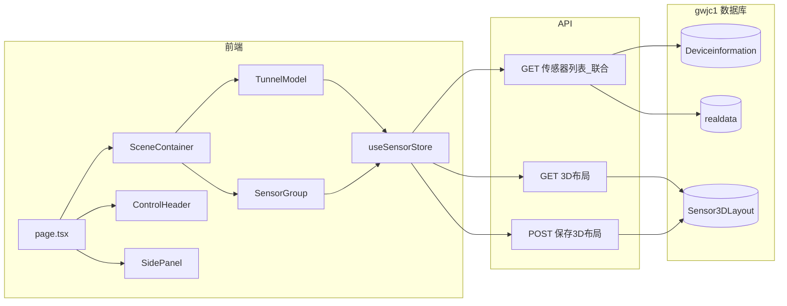

# 智能矿山 3D 传感器管理平台 - 实施计划

## 目标与范围

按 [Project_Spec.md](Project_Spec.md) 实现全栈数字孪生系统：在 3D 巷道模型中布设传感器，支持编辑/预览模式与右侧面板图表展示。**传感器主数据与实时值来自 gwjc1 数据库；3D 位置信息单独持久化（见下文）。**

---

## 数据源与库表说明（gwjc1 数据库）

### 现有表结构（节选关键字段）

- **Deviceinformation**（设备/传感器主数据，表名注意大小写）
  - **ID** int IDENTITY，主键自增。
  - **PointNumber** varchar(6) NOT NULL，测点编号，**作为设备唯一标识**（与 realdata 关联用）。
  - **PointAddress** varchar(50)，安装位置名称。
  - **PointName** varchar(20)，名称；`**PointName = N'分站'` 表示该条为分站**，其余为传感器。
  - **Unit** varchar(10)，测量值单位。
  - 其他：PointType, PointId, Range, TypeName, SetUpAddress, AreaId 等见完整建表。
- **realdata**（实时数据，主键 point）
  - **point** char(10) NOT NULL，主键；与 Deviceinformation.PointNumber 对应（关联时建议 `RTRIM(r.point)` 或 CAST 与 PointNumber 比对，因 point 为 char(10) 可能右补空格）。
  - **ssz** char(30)，实时值（前端展示时可 trim）。
  - **color** char(10)，状态码（与下方枚举对应，接口返回时建议转为数值或保留字符串）。
  - **sj** datetime，数据时间。
  - 其他：address, lx, lc, dw, state 等见完整建表。

### 设备标识与分站筛选

- **设备标识**：以 **Deviceinformation 表为准**，统一使用 **PointNumber** 作为设备唯一标识（前端、3D 位置新表、API 入参/出参均使用 PointNumber）。
- **分站筛选**：仅需满足 `**PointName = N'分站'`** 的为分站。编辑时传感器列表排除分站：`WHERE d.PointName <> N'分站'`（或 `!= N'分站'`）。

### 编辑时传感器列表的筛选与联合

- 编辑模式下可选的传感器列表：**Deviceinformation 与 realdata 联合查询**，排除分站。
- 示例 SQL 思路（字段名与库一致）：
  - `FROM Deviceinformation d INNER JOIN realdata r ON RTRIM(r.point) = d.PointNumber WHERE d.PointName <> N'分站'`
  - 返回字段至少包含：d.PointNumber, d.PointName, d.PointAddress, d.Unit, r.ssz, r.color（及前端需要的其他列）。

### 3D 位置信息：新建表建议

- 在 **gwjc1** 中新建表，仅存「设备在 **3D 模型中的相对位置**」（局部坐标），不关联具体巷道或场景；设备主数据与实时值仍从 Deviceinformation + realdata 读取。
- **建议表结构**（表名 `Sensor3DLayout`）：

| 字段          | 类型                  | 说明                                      |
| ----------- | ------------------- | --------------------------------------- |
| PointNumber | varchar(6) NOT NULL | 设备标识，与 Deviceinformation.PointNumber 一致 |
| LocalX      | float NOT NULL      | 模型局部坐标 X                                |
| LocalY      | float NOT NULL      | 模型局部坐标 Y                                |
| LocalZ      | float NOT NULL      | 模型局部坐标 Z                                |
| CreatedAt   | datetime NULL       | 创建时间                                    |
| UpdatedAt   | datetime NULL       | 更新时间                                    |

- **主键**：PointNumber（一设备一条 3D 布点记录）。
- 前端保存布局：POST 传入 `{ pointNumber, localX, localY, localZ }[]`，后端写入/更新该表；加载 3D 场景：从该表读出所有点位，再与 Deviceinformation + realdata 联合得到带位置、PointName、PointAddress、Unit、ssz、color 的完整列表供渲染与右侧面板展示。

### 传感器状态：按类型分类

- **分站**（PointName = N'分站'）：**通讯正常**、**通讯中断** 两种状态。
- **模拟量传感器**：**正常**、**通讯中断**、**报警**、**断电** 四种状态（与 color 枚举中 16/1/7|8/13 等对应）。
- **开关量传感器**：**开**、**关**、**报警**、**通讯中断** 四种状态（与 color 14/15/7|8/1 等对应）。

展示与图标映射时可按设备类型（分站 / 模拟量 / 开关量）结合 color 做文案与图标区分。

### 传感器状态 color 枚举（底层）

| color 值 | 含义      |
| ------- | ------- |
| -1      | 异常（初始化） |
| 0       | 交流      |
| 1       | 通讯中断    |
| 2       | 直流      |
| 7       | 上报警     |
| 8       | 下报警     |
| 13      | 传感器断线异常 |
| 14      | 开关量 开   |
| 15      | 开关量 关   |
| 16      | 正常      |

### Sensor3DLayout 中「已删除」传感器的处理机制

- **定义**：若某条记录的 **PointNumber 在 Sensor3DLayout 中存在，但在 Deviceinformation 或 realdata 中已不存在**（设备在业务侧已删除），则该布点视为**已删除/孤立**，需要一种机制标识并引导用户清理。
- **后端 GET 3D 布局**：返回数据中区分两类：
  - **有效布点**：Sensor3DLayout 与 Deviceinformation、realdata 能联合出完整信息的点位；
  - **已删除布点**：仅来自 Sensor3DLayout，联合不到设备信息的点位（仅含 PointNumber + LocalX/Y/Z，无 ssz、color 等），前端标记为 `isDeleted: true` 或单独列表。
- **前端展示**：
  - 已删除点位在 3D 场景中**用区别于正常点位的样式显示**（如灰色/半透明图标、或统一「已删除」图标），便于用户识别。
  - **提醒方式**：加载布局后若存在至少一个已删除布点，**弹出可关闭的小窗口**（如 Antd **Notification** 或 **message**）提示：「存在已删除的传感器点位，请切换到编辑模式删除」，用户可关闭，不阻塞操作。
- **编辑模式**：用户可点击已删除点位，执行「从布局中删除」操作（从当前数据中移除该 PointNumber 并调用 POST 保存 3D 布局），从而在 Sensor3DLayout 中删除该条记录，实现清理。

### 状态与图标映射

- 展示模式下 3D 点位上按 color 显示对应图片；建议在 `public/icons/sensor/` 下为各状态提供图标（如 `-1.png`、`16.png`、`7.png`、`8.png` 等），前端维护 `color → 图标路径` 映射，未配置状态可回退为默认图标。
- 前端展示（列表、3D 场景、右侧面板）需根据 color 做状态文案映射；**3D 场景中（展示模式）须按状态显示不同图片/图标**，并在点位上或旁显示**实时值（ssz）**，便于一眼区分状态与数值。

### 3D 视角状态持久化（供下次打开恢复）

- **需求**：localStorage 中**没有**已保存的视角时，按默认方式加载 3D 场景；若用户在编辑或浏览时调整过视角，在**关闭编辑模式或退出浏览（离开页面）前**保存本次的缩放、旋转等信息，下次打开时恢复上次的视角，方便延续上次的浏览/编辑位置。
- **需持久化的 3D 展示相关数据**（已确认）：
  - **缩放**：`camera.zoom`（透视相机缩放倍数）
  - **旋转/观察角度**：**target**（观察目标点 [x,y,z]）与 **camera.position** [x,y,z]（或 theta/phi/radius），还原旋转与距离
  - **正交/透视切换**：当前为透视或正交（如 `isOrthographic: boolean` 或 projection 类型），需保存并恢复
  - **相机 min/max 缩放（或距离）**：若 OrbitControls 或相机设置了 minZoom/maxZoom、minDistance/maxDistance 等且用户可改，则一并保存；否则使用默认值即可
- **相机复位行为**（已确认）：点击「相机复位」时，**除恢复默认视角外，同时清除 localStorage 里已保存的视角**，使下次打开页面使用默认机位。
- **何时写入**：在**退出编辑模式**或**退出预览/浏览模式**时（如切换 Segmented）、以及**页面卸载前**（beforeunload 或 pagehide）将当前视角（含上述全部项）写入 localStorage。
- **何时读取**：页面/场景首次加载时先读 localStorage；**有**则用其恢复相机、OrbitControls 与正交/透视、min/max；**无**则使用默认机位与缩放。
- **存储方式**：使用 **localStorage**；若后续需要跨设备或按用户保存，可增加后端「用户视图偏好」接口。
- **实现要点**：在 `SceneContainer` 或持有 OrbitControls ref 的组件内，挂载时从 localStorage 读入并应用；模式切换与页面卸载前调用保存；Footer「相机复位」执行 default 复位并**清除**已存视角。
- **已采纳的约定**：① localStorage 的 key 固定为 `**gw3d_view_state`**；② **编辑与预览共用同一份视角**，不按模式分别记忆；③ 当前单场景，不区分 sceneId；若后续多巷道/多场景，再增加 sceneId 维度。
- **无需再确认项**：按当前计划与上述约定即可实现。若开发中遇到细节（如 GET 3D 布局返回的 JSON 结构、编辑时传感器为单选逐点布设等），按计划描述或常规约定处理即可，无其他必须事先明确项。

---

## 架构与数据流

---

## 阶段一：项目脚手架与依赖

- 使用 **Next.js 14**（App Router）初始化项目，TypeScript。
- 安装依赖：
  - `@react-three/fiber`、`@react-three/drei`、`three`
  - `antd`
  - `zustand`
  - `echarts`、`echarts-for-react`（右侧面板历史曲线）
- 按规格创建目录与占位文件（见下方「目录与文件」）。3D 布局从 gwjc1 新表读写，不再使用本地 `data/layout.json`。

---

## 阶段二：后端 API 与数据层

- **数据库连接**：Next.js 后端连接 **gwjc1**（SQL Server），使用如 `mssql` 或 `tedious` 等驱动；连接串通过环境变量配置，便于 Windows 部署。
- **传感器列表接口**（编辑时筛选用）：
  - 联合查询 **Deviceinformation** 与 **realdata**，筛选 `PointName <> N'分站'`，关联条件 `RTRIM(r.point) = d.PointNumber`；返回字段至少包含：PointNumber、PointName、PointAddress、Unit、ssz、color 等，供前端下拉/列表与 3D 布点选择。
- **3D 布局接口**（依赖新建的 3D 位置表）：
  - **GET 3D 布局**：从 Sensor3DLayout 读取已布点（PointNumber + LocalX/LocalY/LocalZ）；与 Deviceinformation + realdata 左联合（或先取布局再分别查联合），返回**有效布点**（能联合到设备信息的，带 PointName、ssz、color 等）与**已删除布点**（布局中有但设备表中无的，仅 PointNumber + 位置，标记 `isDeleted: true`），供前端分别渲染与提示。
  - **POST 保存 3D 布局**：接收前端提交的布点数组（**PointNumber** + LocalX/LocalY/LocalZ），写入或更新 Sensor3DLayout（模型内相对位置，不涉及巷道/场景 ID）。
- **类型定义**（`types/sensor.ts`）：前端与后端共用结构；有效传感器含 **pointNumber**、position、pointName、pointAddress、Unit、ssz、color 等；**已删除布点**类型仅含 pointNumber + position（或加 `isDeleted: true`）；color 展示按上文「分站/模拟量/开关量」状态分类与枚举映射文案与图标。

---

## 阶段三：3D 场景初始化（对应文档「任务 1」）

- `**app/page.tsx`**：作为入口，渲染全屏 3D Canvas 与后续要加的 UI。
- `**components/Three/SceneContainer.tsx`**：R3F `<Canvas>` 全屏容器，内挂 `<TunnelModel>`、`<SensorGroup>` 与 `OrbitControls`（来自 drei），保证 1920×1080 下自适应；**3D 视角持久化**：挂载时从 localStorage 恢复（target、camera.position、zoom、正交/透视、min/max，无则默认），模式切换与页面卸载前写入上述全部项。
- `**components/Three/TunnelModel.tsx`**：使用 drei 的 `useGLTF` 加载 `public/models/tunnel.glb`，渲染到场景中心；暂不实现点击逻辑。
- 确认：模型居中、可缩放旋转，无报错。

---

## 阶段四：状态与坐标保存逻辑（对应「任务 2」）

- `**store/useSensorStore.ts`**（Zustand）：
  - 状态：`sensors: Sensor[]`（有效布点，含 pointNumber、position、ssz、color、pointName、pointAddress、Unit 等）、`deletedSensors: SensorLayoutOnly[]`（已删除/孤立布点，仅 pointNumber + position，无设备信息）、`isEditMode`、`selectedSensorId`、`sensorListFromApi`（编辑时可选传感器列表）。
  - 方法：`loadSensorList()`、`addSensor(pointNumber, localPoint)`、`setEditMode`、`selectSensor`、`saveLayoutToServer()`、`loadLayoutFromServer()`（拉取后若存在 `deletedSensors.length > 0` 则触发「已删除」提示）、`removeDeletedFromLayout(pointNumber)`（从布局中移除该已删除点位并 POST 保存）、`clearAll()` 等。
  - **已删除提示**：`loadLayoutFromServer()` 完成后若 `deletedSensors.length > 0`，触发一次可关闭的 Antd Notification，文案：「存在已删除的传感器点位，请切换到编辑模式删除」。
- **编辑时传感器筛选**：进入编辑模式时请求传感器列表接口（Deviceinformation + realdata 联合，`PointName <> N'分站'`）；用户先选择要布点的传感器（以 PointNumber 标识），再在巷道表面点击，将「PointNumber + localPoint」加入布局并保存到 Sensor3DLayout。
- `**components/Three/TunnelModel.tsx`**：仅在 `isEditMode === true` 且已选设备时启用点击；`onPointerDown` → `worldToLocal(event.point)` 得 `localPoint`，调用 `addSensor(当前选中 PointNumber, localPoint)`。
- `**components/Three/SensorGroup.tsx`**：
  - **展示模式**：有效布点显示**实时值（ssz）和状态**，状态按 **color 映射为不同图片/图标**（`public/icons/sensor/`），在 3D 点位处用 Sprite 或贴图展示；实时值在点位旁用 HTML 或 3D 文本/精灵显示。**已删除布点**用区别于正常的样式显示（如灰色/半透明或统一「已删除」图标），不显示 ssz。
  - **编辑模式**：有效布点可显示统一占位图标或简单几何体；**已删除布点**同样可见且可点击，点击后执行「从布局中删除」（调用 `removeDeletedFromLayout(pointNumber)`），从 Sensor3DLayout 中移除该条。
  - 点击**有效**点位在预览模式下打开右侧面板展示详情与 ECharts；点击已删除点位仅在编辑模式下执行删除。

---

## 阶段五：UI 集成（对应「任务 3」与 3.2 节）

- `**app/layout.tsx`**：引入 Antd `ConfigProvider`，科技蓝/暗色主题；可设置 `antd.css` 或按 Antd 5 主题变量配置。
- `**components/UI/ControlHeader.tsx`**：顶部固定，含项目标题 + Antd `Segmented`（选项「编辑」「预览」），绑定 `isEditMode`，切换时更新 store；**在切换编辑/预览时触发一次「保存 3D 视角到 localStorage」**（由 SceneContainer 暴露回调或通过 ref/context 调用），以便退出当前模式前记住视角。
- `**components/UI/SidePanel.tsx`**：Antd `Drawer`，从右侧滑出；`selectedSensorId` 非空时打开，展示该传感器的 **pointName、pointaddress、Unit、ssz（实时值）、color（状态文案）** 及 ECharts 历史曲线（可先用 mock 或后续接历史库）；关闭时清空 `selectedSensorId`。
- **Footer 浮动按钮**：在 `page.tsx` 或单独组件中实现：
  - **PerspectiveCamera 复位**：通过 R3F/drei 的 camera 或 controls ref 调用 `reset()` 恢复默认视角，并**同时清除 localStorage 中已保存的视角**，使下次打开使用默认机位；
  - 保存当前布局（调用 store 的 `saveLayoutToServer()`，写入 3D 位置新表）；
  - 一键清空（清空当前布局并调用 POST 写空 3D 位置）。
- **页面卸载前保存视角**：在 `page.tsx` 或 `SceneContainer` 内监听 `beforeunload` 或 `pagehide`，在用户关闭/离开页面前将当前 target + camera.position + zoom 写入 localStorage。
- 视图模式：禁用 TransformControls（若后续加入），点击**有效**传感器点位时设置 `selectedSensorId` 并打开 Drawer。
- **已删除点位提示**：`loadLayoutFromServer()` 后若存在已删除布点，在页面顶部或角落弹出**可关闭的 Antd Notification**，文案：「存在已删除的传感器点位，请切换到编辑模式删除」，用户关闭后不再自动弹出（当次会话）。

---

## 阶段六：编辑/预览行为与细节

- **编辑模式**：仅在此模式下在 TunnelModel 上点击可新增点位；可选用 drei 的 `TransformControls` 对已选点位做平移（可选）。**已删除布点**在此模式下可点击，执行「从布局中删除」并 POST 保存，清理 Sensor3DLayout 中对应记录。
- **展示/预览模式**：
  - **3D 场景**：有效传感器点位显示**实时值（ssz）与状态**，状态通过 **color 映射为不同图片**（分站/模拟量/开关量按前文状态分类与图标）；**已删除布点**用灰色或「已删除」图标区分显示。
  - 点击有效布设点位 → 打开右侧 Drawer，展示传感器信息 + ECharts 曲线。
- 确保 1920×1080 下布局不溢出，Header/Footer 固定，Canvas 占满剩余区域；`public/background/` 若需科技感底图，可在 Scene 或页面背景中引用。

---

## 目录与文件清单

| 路径                                    | 说明                                                                                        |
| ------------------------------------- | ----------------------------------------------------------------------------------------- |
| `app/layout.tsx`                      | Antd ConfigProvider + 根布局                                                                 |
| `app/page.tsx`                        | 场景入口 + Header + Drawer + Footer 按钮                                                        |
| `app/api/sensors/route.ts`            | 传感器列表（Deviceinformation+realdata 联合，排除分站）、3D 布局 GET/POST（读写 Sensor3DLayout）               |
| `components/Three/SceneContainer.tsx` | Canvas 全屏 + OrbitControls；3D 视角持久化（挂载恢复、模式切换与页面卸载前写入 localStorage）                        |
| `components/Three/TunnelModel.tsx`    | 巷道 GLB + 点击取 localPoint                                                                   |
| `components/Three/SensorGroup.tsx`    | 渲染有效与已删除点位；展示模式显示 ssz、状态图标；已删除用灰色/已删除图标；编辑模式可点击已删除点位删除                                    |
| `components/UI/ControlHeader.tsx`     | 标题 + 编辑/预览 Segmented                                                                      |
| `components/UI/SidePanel.tsx`         | Drawer + 传感器详情 + ECharts                                                                  |
| `store/useSensorStore.ts`             | Zustand：sensors、deletedSensors、isEditMode、selectedSensorId、已删除提示与 removeDeletedFromLayout |
| `types/sensor.ts`                     | Sensor 类型（含 ssz、color、position、pointName、Unit 等）                                          |
| gwjc1.dbo.Sensor3DLayout（新建）          | PointNumber + LocalX/Y/Z（模型内相对位置），由后端 API 读写                                              |
| `public/models/tunnel.glb`            | 需用户自备或占位说明                                                                                |
| `public/icons/sensor/`                | 按 color 状态存放的传感器图标（如 normal.png, alarm.png 等），展示模式在点位上显示                                  |

---

## 依赖与约束摘要

- **坐标系**：所有存储与计算使用巷道**局部坐标**，`localPoint = tunnelMesh.worldToLocal(event.point)`。
- **数据源**：传感器主数据与实时值来自 **gwjc1** 的 Deviceinformation、realdata（设备标识用 **PointNumber**）；3D 位置存 **Sensor3DLayout**（新建表），由 Next.js API 读写。
- **部署**：Next.js + Node + SQL Server（gwjc1），连接串通过环境变量配置，适合 Windows 一键部署。
- **3D 视角记忆**：target、camera.position、zoom、**正交/透视切换**、**相机 min/max 缩放**存 **localStorage**，挂载时恢复、模式切换与页面卸载前写入；**相机复位**时恢复默认视角并**清除**已存视角。
- **占位**：若暂无 `tunnel.glb`，可在文档或 README 中说明需将模型放入 `public/models/tunnel.glb`，或先用简单 Box 几何体替代以便联调。

---

## 实施顺序建议

1. 阶段一：脚手架 + 目录与空文件
2. 阶段二：API 实现 + 类型定义
3. 阶段三：3D 场景与巷道加载 + **视角持久化**（SceneContainer 挂载时从 localStorage 恢复，无则默认）
4. 阶段四：Zustand store + 点击布点 + SensorGroup 渲染 + 保存
5. 阶段五：Antd 布局、Header、Drawer、Footer 按钮、ECharts mock；**模式切换与页面卸载前写入视角**；Footer 复位（可选清除 localStorage）
6. 阶段六：编辑/预览行为收尾与 1920×1080 适配

按此顺序可实现「任务 1 → 任务 2 → 任务 3」的递进，并与 Project_Spec.md 的目录与逻辑一致。**3D 视角持久化**在阶段三接入读取、在阶段五接入写入（模式切换 + beforeunload/pagehide）。
